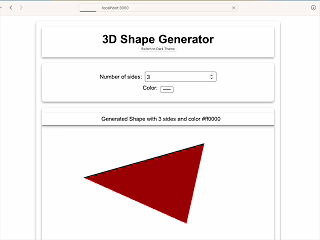

# 3D Shape Generator

This project is a 3D Shape Generator built with **React** and **Three.js**. It allows users to generate and visualize 3D shapes with customizable properties such as the number of sides and color. The app also includes a theme switcher to toggle between light and dark themes.




## Features

- Generate 3D shapes with a customizable number of sides.
- Change the color of the generated shape.
- Rotate the shape for better visualization.
- Toggle between light and dark themes.
- Responsive design to fit different screen sizes.

## Brief Logic

The main logic of the app is implemented in the `ShapeGenerator` component. It uses the `@react-three/fiber` library to render 3D shapes and the `@react-three/drei` library for additional utilities like `OrbitControls`. The shape is created using Three.js's `CylinderGeometry`, and its properties are updated based on user input.

The theme switching functionality is managed using a React context (`ThemeContext`). The current theme is stored in the context, and the `App` component uses this context to apply the appropriate styles.

## Important Libraries Used

- **React**: A JavaScript library for building user interfaces.
- **Three.js**: A library for creating 3D graphics in the browser.
- **@react-three/fiber**: A React renderer for Three.js.
- **@react-three/drei**: A collection of useful helpers for `@react-three/fiber`.
- **react-scripts**: Scripts and configuration used by Create React App.

## How to Start

1. Clone the repository:

```sh
git clone https://github.com/your-username/my-3d-shape-app.git
cd my-3d-shape-app
```

2. Install the dependencies,

Run the following command in the project directory:

```sh
npm install
```

3. Start the development server:


```sh
npm start
```

4. Open http://localhost:3000 in your browser to view the app.


## Additional Information

This project was bootstrapped with [Create React App](https://github.com/facebook/create-react-app). For more information on how to perform common tasks, you can refer to the [Create React App documentation](https://create-react-app.dev/docs/getting-started/).
